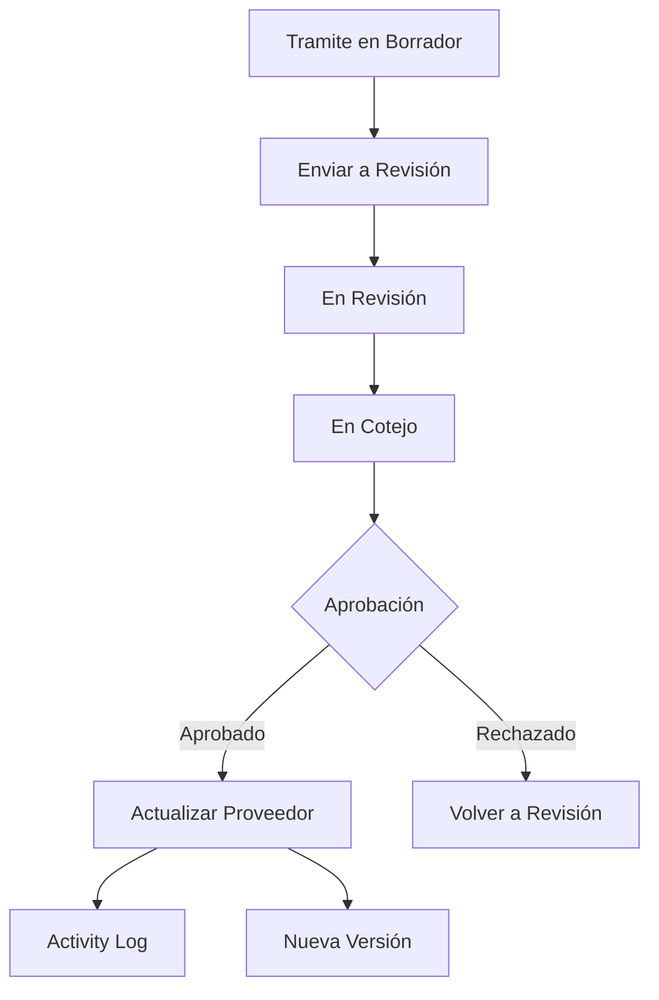

# Sistema de Versionado de Proveedores con Activity Log

## Descripción del Sistema

Este sistema resuelve el problema del versionado de datos de proveedores a través del flujo de trámites:

- **Inscripción**: Proveedor rellena datos por primera vez
- **Actualización**: Proveedor modifica datos existentes, se revisan y aprueban
- **Renovación**: Similar a actualización pero mantiene vigencia

### Características Principales

✅ **Historial Completo**: Mantiene registro de todos los cambios usando Activity Log  
✅ **Versionado Automático**: Incrementa versión cuando se aprueba un trámite  
✅ **Datos Preservados**: Los datos de trámites anteriores nunca se pierden  
✅ **Transaccional**: Todas las operaciones son atómicas  
✅ **Auditable**: Registro completo de quién y cuándo hizo cada cambio  

## Instalación

### 1. Instalar Activity Log

```bash
composer require spatie/laravel-activitylog
```

### 2. Publicar y ejecutar migraciones

```bash
# Publicar migración de Activity Log
php artisan vendor:publish --provider="Spatie\Activitylog\ActivitylogServiceProvider" --tag="activitylog-migrations"

# Ejecutar todas las migraciones
php artisan migrate
```

### 3. Configurar Activity Log (opcional)

```bash
# Publicar archivo de configuración
php artisan vendor:publish --provider="Spatie\Activitylog\ActivitylogServiceProvider" --tag="activitylog-config"
```

## Arquitectura del Sistema

### Estructura de Datos

```
proveedores (datos actuales)
├── giro_actual
├── pagina_web_actual  
├── direccion_actual_id
├── version_datos
└── tramite_aprobacion_id

tramites (datos históricos)
├── tramite_datos_generales
├── tramite_contactos
├── tramite_actividades
└── estados del trámite

activity_log (historial completo)
├── todos los cambios
├── contexto del trámite
└── usuario responsable
```

### Flujo de Datos



## Uso del Sistema

### 1. Aprobar un Trámite

```php
use App\Services\ProveedorVersioningService;

$service = app(ProveedorVersioningService::class);

// Aprobar trámite y actualizar proveedor
$resultado = $service->procesarAprobacionTramite($tramite, $usuarioAprobador);

if ($resultado) {
    // El proveedor ahora tiene una nueva versión con los datos del trámite
    echo "Nueva versión: " . $tramite->proveedor->version_datos;
}
```

### 2. Consultar Historial de Versiones

```php
// Obtener historial completo
$historial = $service->obtenerHistorialVersiones($proveedor);

foreach ($historial as $version) {
    echo "Versión {$version['version']} - {$version['tipo_tramite']} - {$version['fecha']}";
}
```

### 3. Comparar Versiones

```php
// Comparar dos versiones específicas
$comparacion = $service->compararVersiones($proveedor, $versionA, $versionB);

foreach ($comparacion['diferencias'] as $campo => $cambio) {
    echo "{$campo}: {$cambio['anterior']} → {$cambio['nuevo']}";
}
```

### 4. API REST

```http
# Aprobar trámite
POST /admin/tramites/{id}/aprobar
Content-Type: application/json
{
    "comentarios": "Documentación completa y correcta"
}

# Obtener historial
GET /admin/proveedores/{id}/historial/json

# Comparar versiones  
GET /admin/proveedores/{id}/comparar/1/3
```

## Qué se Registra en Activity Log

### 1. Aprobación de Trámites
```json
{
    "log_name": "tramite_aprobacion",
    "description": "Trámite de Actualización aprobado",
    "properties": {
        "tipo_tramite": "Actualización",
        "proveedor_id": 123,
        "datos_tramite": {
            "datos_generales": {...},
            "contactos": [...],
            "actividades": [...]
        }
    }
}
```

### 2. Actualización de Datos del Proveedor
```json
{
    "log_name": "datos_proveedor_actualizados", 
    "description": "Datos de proveedor actualizados a versión 3 desde trámite de Actualización",
    "properties": {
        "tramite_id": 456,
        "version_anterior": 2,
        "version_nueva": 3,
        "datos_anteriores": {...},
        "cambios_aplicados": {...}
    }
}
```

### 3. Actualización de Contactos
```json
{
    "log_name": "contactos_proveedor_actualizados",
    "description": "Contactos de proveedor actualizados desde trámite",
    "properties": {
        "tramite_id": 456,
        "contactos_anteriores": [...],
        "contactos_nuevos": [...]
    }
}
```

## Ventajas del Sistema con Activity Log

### 1. **Historial Completo y Detallado**
- Registra automáticamente todos los cambios
- Incluye contexto completo (usuario, fecha, datos anteriores)
- Permite recrear cualquier estado anterior

### 2. **Versionado Inteligente**
- Solo incrementa versión cuando se aprueba un trámite
- Mantiene referencia al trámite que generó cada versión
- Preserva datos históricos de todos los trámites

### 3. **Auditoría Completa**
- Registro de quién hizo cada cambio
- Cuándo se hizo cada cambio
- Qué datos cambiaron exactamente
- Contexto del trámite que originó el cambio

### 4. **Trazabilidad Total**
- Desde cualquier versión actual puedes rastrear:
  - Qué trámite la generó
  - Qué usuario la aprobó
  - Qué datos cambiaron
  - Cuándo ocurrió

## Comparación con Alternativas

| Enfoque | Ventajas | Desventajas |
|---------|----------|-------------|
| **Activity Log** ✅ | Automático, detallado, auditable | Requiere paquete externo |
| **Soft Deletes** | Simple de implementar | No registra cambios, solo eliminaciones |
| **Tablas de Versiones** | Control total | Mucho código manual, complejo |
| **Event Sourcing** | Máxima flexibilidad | Muy complejo, overkill |

## Configuración Avanzada

### 1. Personalizar Activity Log

```php
// En config/activitylog.php
return [
    'enabled' => env('ACTIVITY_LOGGER_ENABLED', true),
    'delete_records_older_than_days' => 365,
    'default_log_name' => 'default',
    'table_name' => 'activity_log',
];
```

### 2. Limpiar Logs Antiguos

```php
// Comando artisan para limpiar logs
php artisan activitylog:clean

// O programáticamente
activity()->where('created_at', '<', now()->subYear())->delete();
```

### 3. Exportar Historial

```php
// Exportar historial de un proveedor a Excel/PDF
$historial = $service->obtenerHistorialVersiones($proveedor);
Excel::download(new HistorialProveedorExport($historial), 'historial.xlsx');
```

## Implementación Paso a Paso

1. ✅ Instalar Activity Log
2. ✅ Ejecutar migraciones de versionado  
3. ✅ Configurar modelos con LogsActivity trait
4. ✅ Implementar ProveedorVersioningService
5. ✅ Crear controladores para aprobación
6. ✅ Definir rutas del API
7. ⬜ Crear vistas para el historial
8. ⬜ Implementar exportación de reportes
9. ⬜ Configurar notificaciones de cambios

## Consultas Útiles

```php
// Obtener todas las versiones de un proveedor
$proveedor->activities()->where('log_name', 'datos_proveedor_actualizados')->get();

// Obtener cambios de los últimos 30 días
activity()->where('created_at', '>=', now()->subDays(30))->get();

// Obtener todos los cambios de un usuario específico
activity()->causedBy($usuario)->get();

// Obtener cambios por tipo de trámite
activity()->where('properties->tipo_tramite', 'Actualización')->get();
```

## Conclusión

Este sistema con **Activity Log** es la solución más robusta para tu caso de uso porque:

1. **Automático**: No requiere código manual para logging
2. **Completo**: Registra todos los aspectos de los cambios
3. **Estándar**: Usa un paquete bien mantenido y documentado
4. **Escalable**: Funciona bien con miles de registros
5. **Flexible**: Permite consultas y reportes complejos

Es mucho mejor que soft deletes o sistemas manuales de versionado para tu caso específico de gestión de trámites y proveedores. 