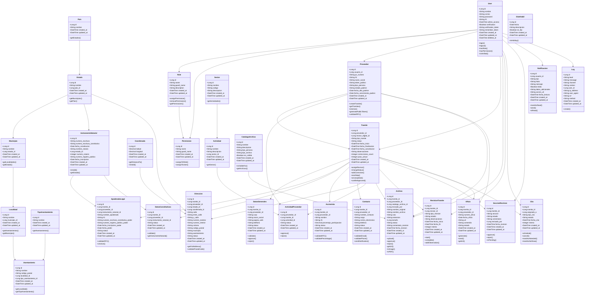

# Diagrama de Clases - Sistema JWT

```mermaid
classDiagram
    class User {
        +Long id
        +String nombre
        +String correo
        +String password
        +String rfc
        +DateTime ultimo_acceso
        +Boolean verification
        +String verification_token
        +String remember_token
        +DateTime created_at
        +DateTime updated_at
        +DateTime deleted_at
        +login()
        +logout()
        +hasRole()
        +hasPermission()
        +isVerified()
    }

    class Role {
        +Long id
        +String name
        +String guard_name
        +String description
        +DateTime created_at
        +DateTime updated_at
        +assignPermission()
        +removePermission()
        +getPermissions()
    }

    class Permission {
        +Long id
        +String name
        +String guard_name
        +DateTime created_at
        +DateTime updated_at
        +assignToRole()
        +assignToUser()
    }

    class Pais {
        +Long id
        +String nombre
        +DateTime created_at
        +DateTime updated_at
        +getEstados()
    }

    class Estado {
        +Long id
        +String nombre
        +Long pais_id
        +DateTime created_at
        +DateTime updated_at
        +getMunicipios()
        +getPais()
    }

    class Municipio {
        +Long id
        +String nombre
        +Long estado_id
        +DateTime created_at
        +DateTime updated_at
        +getLocalidades()
        +getEstado()
    }

    class Localidad {
        +Long id
        +String nombre
        +Long municipio_id
        +DateTime created_at
        +DateTime updated_at
        +getAsentamientos()
        +getMunicipio()
    }

    class TipoAsentamiento {
        +Long id
        +String nombre
        +DateTime created_at
        +DateTime updated_at
        +getAsentamientos()
    }

    class Asentamiento {
        +Long id
        +String nombre
        +String codigo_postal
        +Long localidad_id
        +Long tipo_asentamiento_id
        +DateTime created_at
        +DateTime updated_at
        +getLocalidad()
        +getTipoAsentamiento()
    }

    class Coordenada {
        +Long id
        +Decimal latitud
        +Decimal longitud
        +DateTime created_at
        +DateTime updated_at
        +getDistanceTo()
        +isValid()
    }

    class Proveedor {
        +Long id
        +Long usuario_id
        +String pv_numero
        +String rfc
        +String razon_social
        +String token_publico
        +String tipo_persona
        +String estado_padron
        +Date fecha_alta_padron
        +Date fecha_vencimiento_padron
        +DateTime created_at
        +DateTime updated_at
        +createTramite()
        +getTramites()
        +isActive()
        +generatePublicToken()
        +validateRFC()
    }

    class Tramite {
        +Long id
        +Long proveedor_id
        +Long revisor_digital_id
        +String tipo_tramite
        +String status
        +DateTime fecha_inicio
        +DateTime fecha_finalizacion
        +DateTime fecha_cancelacion
        +String observaciones
        +Integer correcciones_count
        +Integer paso_actual
        +DateTime created_at
        +DateTime updated_at
        +assignRevisor()
        +changeStatus()
        +addCorrection()
        +nextStep()
        +isCompleted()
        +canBeApproved()
    }

    class DatosGenerales {
        +Long id
        +Long tramite_id
        +Long proveedor_id
        +String curp
        +String razon_social
        +String pagina_web
        +String telefono
        +String status
        +DateTime created_at
        +DateTime updated_at
        +validate()
        +approve()
        +reject()
    }

    class InstrumentoNotarial {
        +Long id
        +String numero_escritura
        +String numero_escritura_constitutiva
        +Date fecha_constitucion
        +String nombre_notario
        +Long estado_id
        +Integer numero_notario
        +String numero_registro_publico
        +Date fecha_inscripcion
        +DateTime created_at
        +DateTime updated_at
        +isValid()
        +getEstado()
    }

    class ApoderadoLegal {
        +Long id
        +Long tramite_id
        +Long proveedor_id
        +Long instrumento_notarial_id
        +String nombre_apoderado
        +String rfc
        +String numero_escritura_constitutiva_poder
        +String numero_registro_publico_poder
        +Date fecha_inscripcion_poder
        +Date fecha_poder
        +String status
        +DateTime created_at
        +DateTime updated_at
        +validateRFC()
        +isActive()
    }

    class DatosConstitutivos {
        +Long id
        +Long tramite_id
        +Long proveedor_id
        +Long instrumento_notarial_id
        +String status
        +DateTime created_at
        +DateTime updated_at
        +validate()
        +getInstrumentoNotarial()
    }

    class Accionista {
        +Long id
        +Long tramite_id
        +Long proveedor_id
        +String nombre
        +String rfc
        +Decimal porcentaje_participacion
        +String status
        +DateTime created_at
        +DateTime updated_at
        +validateRFC()
        +validatePercentage()
    }

    class Contacto {
        +Long id
        +Long tramite_id
        +Long proveedor_id
        +String nombre_contacto
        +String cargo
        +String correo_electronico
        +String telefono
        +String status
        +DateTime created_at
        +DateTime updated_at
        +validateEmail()
        +validatePhone()
        +sendNotification()
    }

    class Direccion {
        +Long id
        +Long tramite_id
        +Long proveedor_id
        +Long estado_id
        +Long coordenada_id
        +String calle
        +String entre_calle
        +String y_calle
        +String numero_exterior
        +String numero_interior
        +String colonia
        +String codigo_postal
        +String municipio
        +String asentamiento
        +String status
        +DateTime created_at
        +DateTime updated_at
        +getFullAddress()
        +validatePostalCode()
    }

    class Sector {
        +Long id
        +String nombre
        +String codigo
        +String descripcion
        +DateTime created_at
        +DateTime updated_at
        +getActividades()
    }

    class Actividad {
        +Long id
        +String nombre
        +String descripcion
        +Long sector_id
        +DateTime created_at
        +DateTime updated_at
        +getSector()
    }

    class ActividadProveedor {
        +Long id
        +Long proveedor_id
        +Long tramite_id
        +Long actividad_id
        +String status
        +DateTime created_at
        +DateTime updated_at
        +approve()
        +reject()
    }

    class CatalogoArchivo {
        +Long id
        +String nombre
        +String descripcion
        +String tipo_persona
        +String tipo_archivo
        +Boolean es_visible
        +DateTime created_at
        +DateTime updated_at
        +isVisibleFor()
        +getArchivos()
    }

    class Archivo {
        +Long id
        +Long tramite_id
        +Long proveedor_id
        +Long catalogo_archivo_id
        +Long revisado_por
        +String nombre_original
        +String nombre_archivo
        +String ruta
        +String extension
        +Long tamaño
        +String status
        +String comentario_revision
        +DateTime fecha_revision
        +DateTime created_at
        +DateTime updated_at
        +upload()
        +approve()
        +reject()
        +getUrl()
        +isImage()
        +isPDF()
    }

    class RevisionTramite {
        +Long id
        +Long tramite_id
        +Long revisor_id
        +String tipo_revision
        +String estado
        +String observaciones
        +DateTime fecha_inicio
        +DateTime fecha_fin
        +Integer intento
        +DateTime created_at
        +DateTime updated_at
        +start()
        +complete()
        +addObservation()
    }

    class SeccionRevision {
        +Long id
        +Long tramite_id
        +String seccion
        +String estado
        +String comentario
        +Long revisado_por
        +DateTime fecha_revision
        +DateTime created_at
        +DateTime updated_at
        +approve()
        +reject()
        +isPending()
    }

    class Cita {
        +Long id
        +Long tramite_id
        +Long asignado_a
        +String tipo_cita
        +String estado
        +DateTime fecha_cita
        +Integer intento
        +DateTime created_at
        +DateTime updated_at
        +schedule()
        +cancel()
        +markAsAttended()
        +markAsNoShow()
    }

    class Oficio {
        +Long id
        +Long tramite_id
        +Long proveedor_id
        +String numero_oficio
        +Date fecha_oficio
        +String url
        +String contenido
        +String estado
        +DateTime created_at
        +DateTime updated_at
        +generate()
        +send()
        +getUrl()
    }

    class Notificacion {
        +Long id
        +Long usuario_id
        +String tipo
        +String titulo
        +String mensaje
        +Boolean leida
        +String datos_adicionales
        +String accion_url
        +DateTime fecha_lectura
        +DateTime created_at
        +DateTime updated_at
        +markAsRead()
        +send()
        +isRead()
    }

    class DiaInhabil {
        +Long id
        +Date fecha
        +String descripcion
        +Boolean es_fijo
        +DateTime created_at
        +DateTime updated_at
        +isHoliday()
    }

    class Log {
        +Long id
        +String level
        +String message
        +String channel
        +String context
        +Long user_id
        +String ip_address
        +String user_agent
        +String url
        +String method
        +DateTime created_at
        +DateTime updated_at
        +create()
    }

    User --> Role
    Role --> Permission
    User --> Permission
    
    Pais --> Estado
    Estado --> Municipio
    Municipio --> Localidad
    Localidad --> Asentamiento
    TipoAsentamiento --> Asentamiento
    
    User --> Proveedor
    Proveedor --> Tramite
    User --> Tramite
    
    Tramite --> DatosGenerales
    Tramite --> ApoderadoLegal
    Tramite --> DatosConstitutivos
    Tramite --> Accionista
    Tramite --> Contacto
    Tramite --> Direccion
    
    Estado --> InstrumentoNotarial
    InstrumentoNotarial --> ApoderadoLegal
    InstrumentoNotarial --> DatosConstitutivos
    
    Sector --> Actividad
    Actividad --> ActividadProveedor
    Proveedor --> ActividadProveedor
    Tramite --> ActividadProveedor
    
    CatalogoArchivo --> Archivo
    Tramite --> Archivo
    Proveedor --> Archivo
    User --> Archivo
    
    Tramite --> RevisionTramite
    Tramite --> SeccionRevision
    Tramite --> Cita
    User --> RevisionTramite
    User --> Cita
    User --> SeccionRevision
    
    Tramite --> Oficio
    Proveedor --> Oficio
    User --> Notificacion
    
    Estado --> Direccion
    Coordenada --> Direccion
    
    User --> Log
```