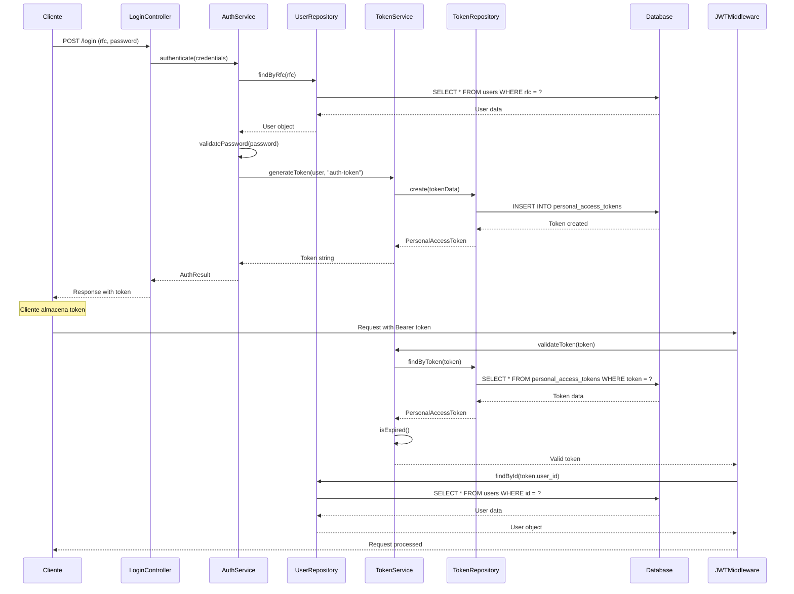
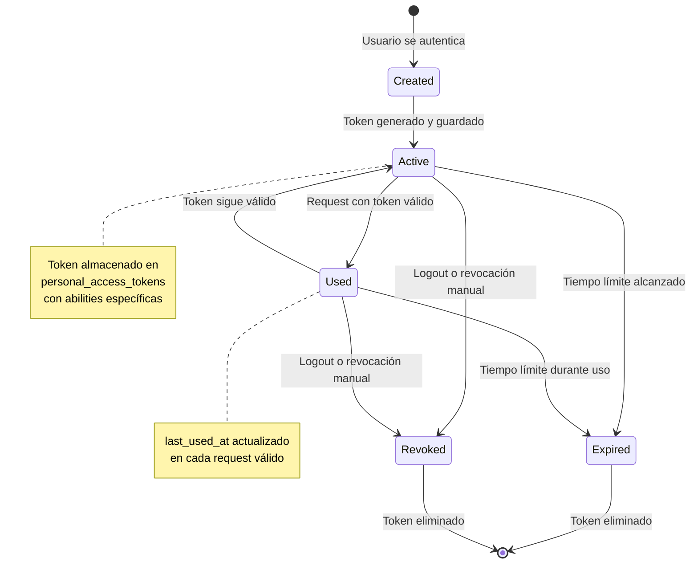
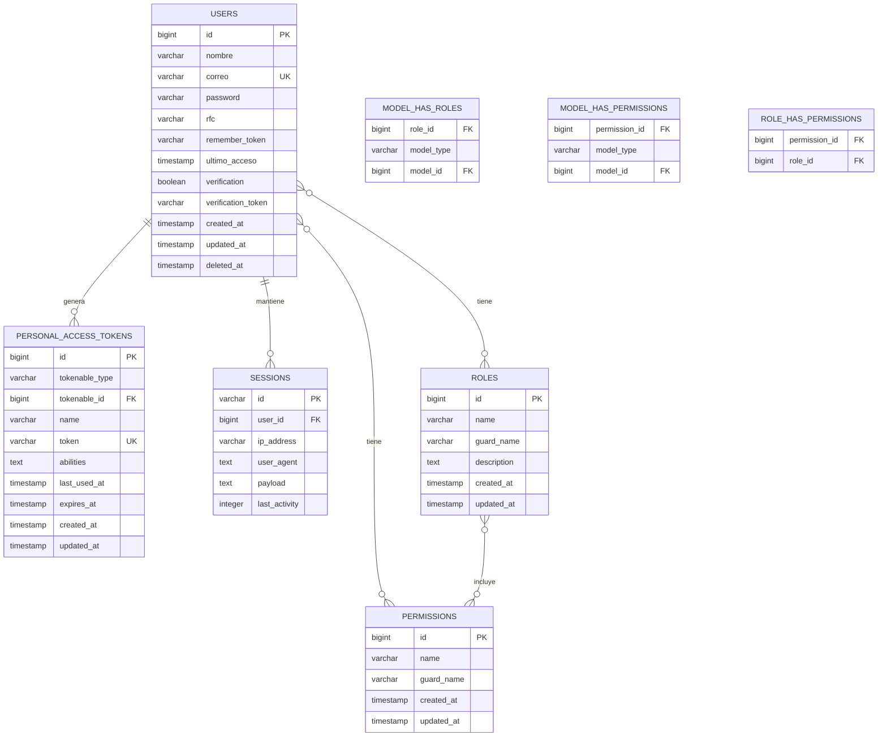

# Diagrama de Clases JWT - Sistema de Autenticación

## Diagrama de Clases Principal

```mermaid
classDiagram
    %% ===== CLASES PRINCIPALES DE AUTENTICACIÓN =====
    class User {
        +Long id
        +String nombre
        +String correo
        +String password
        +String rfc
        +DateTime ultimo_acceso
        +Boolean verification
        +String verification_token
        +String remember_token
        +DateTime created_at
        +DateTime updated_at
        +DateTime deleted_at
        +createToken(name: String, abilities: Array): PersonalAccessToken
        +tokens(): HasMany
        +hasRole(role: String): Boolean
        +hasPermission(permission: String): Boolean
        +isVerified(): Boolean
        +getEmailForPasswordReset(): String
    }

    class PersonalAccessToken {
        +Long id
        +String tokenable_type
        +Long tokenable_id
        +String name
        +String token
        +Text abilities
        +DateTime last_used_at
        +DateTime expires_at
        +DateTime created_at
        +DateTime updated_at
        +can(ability: String): Boolean
        +canAny(abilities: Array): Boolean
        +updateLastUsed(): void
        +isExpired(): Boolean
    }

    class Session {
        +String id
        +Long user_id
        +String ip_address
        +Text user_agent
        +Text payload
        +Integer last_activity
        +user(): BelongsTo
        +isExpired(): Boolean
        +updateActivity(): void
    }

    %% ===== CLASES DE ROLES Y PERMISOS =====
    class Role {
        +Long id
        +String name
        +String guard_name
        +String description
        +DateTime created_at
        +DateTime updated_at
        +permissions(): BelongsToMany
        +users(): MorphToMany
        +assignPermission(permission: Permission): void
        +removePermission(permission: Permission): void
        +hasPermission(permission: String): Boolean
    }

    class Permission {
        +Long id
        +String name
        +String guard_name
        +DateTime created_at
        +DateTime updated_at
        +roles(): BelongsToMany
        +users(): MorphToMany
        +assignToRole(role: Role): void
        +assignToUser(user: User): void
    }

    %% ===== CLASES DE SERVICIOS =====
    class AuthService {
        -UserRepository userRepository
        -TokenService tokenService
        +authenticate(credentials: Object): AuthResult
        +register(userData: Object): User
        +generateToken(user: User, name: String): PersonalAccessToken
        +validateToken(token: String): Boolean
        +revokeToken(token: String): void
        +logout(user: User): void
        +refreshToken(user: User): PersonalAccessToken
    }

    class TokenService {
        -Config config
        +generateToken(user: User, name: String): PersonalAccessToken
        +validateToken(token: String): Boolean
        +extractUserFromToken(token: String): User
        +revokeToken(token: String): void
        +isTokenExpired(token: String): Boolean
        +updateLastUsed(token: String): void
    }

    %% ===== CLASES DE MIDDLEWARE =====
    class JWTMiddleware {
        -TokenService tokenService
        +handle(request: Request, next: Closure): Response
        +authenticate(request: Request): User
        +validateToken(token: String): Boolean
        +setUser(request: Request, user: User): void
    }

    class RoleMiddleware {
        +handle(request: Request, next: Closure, roles: String[]): Response
        +hasRequiredRole(user: User, roles: String[]): Boolean
        +checkRole(user: User, role: String): Boolean
    }

    class PermissionMiddleware {
        +handle(request: Request, next: Closure, permissions: String[]): Response
        +hasRequiredPermission(user: User, permissions: String[]): Boolean
        +checkPermission(user: User, permission: String): Boolean
    }

    %% ===== CLASES DE CONTROLADORES =====
    class LoginController {
        -AuthService authService
        +showLoginForm(): View
        +login(request: Request): Response
        +logout(request: Request): Response
        +username(): String
        +validateLogin(request: Request): void
        +authenticated(request: Request, user: User): Response
    }

    class RegisterController {
        -AuthService authService
        +showRegistrationForm(): View
        +register(request: Request): Response
        +validateRegistration(request: Request): void
        +createUser(data: Object): User
    }

    %% ===== CLASES DE REPOSITORIOS =====
    class UserRepository {
        +findById(id: Long): User
        +findByEmail(email: String): User
        +findByRfc(rfc: String): User
        +create(data: Object): User
        +update(id: Long, data: Object): User
        +delete(id: Long): Boolean
        +findByToken(token: String): User
    }

    class TokenRepository {
        +findByToken(token: String): PersonalAccessToken
        +findByUser(userId: Long): PersonalAccessToken[]
        +create(data: Object): PersonalAccessToken
        +update(id: Long, data: Object): PersonalAccessToken
        +delete(id: Long): Boolean
        +revokeByUser(userId: Long): void
        +cleanExpired(): void
    }

    %% ===== CLASES DE RESULTADOS =====
    class AuthResult {
        +Boolean success
        +String message
        +User user
        +PersonalAccessToken token
        +String error
        +isSuccess(): Boolean
        +getToken(): String
        +getUser(): User
    }

    %% ===== RELACIONES =====
    
    %% User -> PersonalAccessToken (1:N)
    User ||--o{ PersonalAccessToken : "genera"
    
    %% User -> Session (1:N)
    User ||--o{ Session : "mantiene"
    
    %% User -> Role (N:N)
    User }o--o{ Role : "tiene"
    
    %% User -> Permission (N:N)
    User }o--o{ Permission : "tiene"
    
    %% Role -> Permission (N:N)
    Role }o--o{ Permission : "incluye"
    
    %% Controllers -> Services
    LoginController --> AuthService : "usa"
    RegisterController --> AuthService : "usa"
    
    %% Services -> Repositories
    AuthService --> UserRepository : "usa"
    AuthService --> TokenService : "usa"
    TokenService --> TokenRepository : "usa"
    
    %% Middleware -> Services
    JWTMiddleware --> TokenService : "usa"
    RoleMiddleware --> User : "verifica"
    PermissionMiddleware --> User : "verifica"
    
    %% AuthService -> Models
    AuthService --> User : "maneja"
    AuthService --> PersonalAccessToken : "genera"
    AuthService --> AuthResult : "retorna"
```

## Diagrama de Flujo de Autenticación



## Diagrama de Estados del Token



## Estructura de Base de Datos



## Características del Sistema JWT

### 🔐 **Autenticación Segura**
- **Laravel Sanctum**: Sistema de autenticación API moderno
- **Tokens de Acceso Personal**: Generación y validación automática
- **Expiración Configurable**: Control de tiempo de vida de tokens
- **Revocación**: Capacidad de invalidar tokens manualmente

### 🛡️ **Autorización Robusta**
- **Sistema de Roles**: Asignación de roles a usuarios
- **Permisos Granulares**: Control de acceso por funcionalidad
- **Middleware de Seguridad**: Validación automática en rutas
- **Verificación de Email**: Confirmación de cuenta requerida

### 📊 **Gestión de Sesiones**
- **Sesiones Persistentes**: Almacenamiento en base de datos
- **Control de Actividad**: Seguimiento de última actividad
- **Expiración Automática**: Limpieza de sesiones inactivas
- **Múltiples Dispositivos**: Soporte para múltiples sesiones

### 🔄 **Flujo de Autenticación**
1. **Login**: Validación de credenciales (RFC + Password)
2. **Generación de Token**: Creación de token único
3. **Almacenamiento**: Guardado en `personal_access_tokens`
4. **Validación**: Verificación en cada request
5. **Autorización**: Verificación de roles y permisos
6. **Logout**: Revocación del token

### 🏗️ **Arquitectura Modular**
- **Separación de Responsabilidades**: Controllers, Services, Repositories
- **Inyección de Dependencias**: Acoplamiento bajo entre componentes
- **Middleware Personalizable**: Fácil extensión de funcionalidad
- **Base de Datos Optimizada**: Índices y relaciones eficientes
