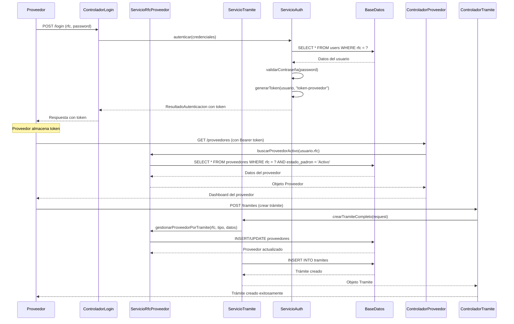
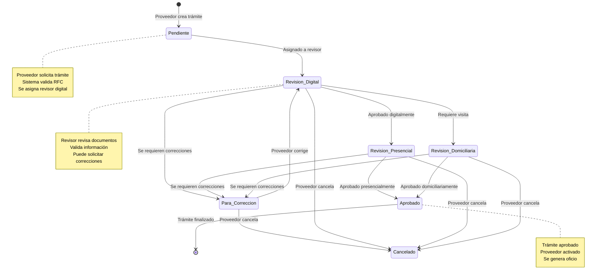
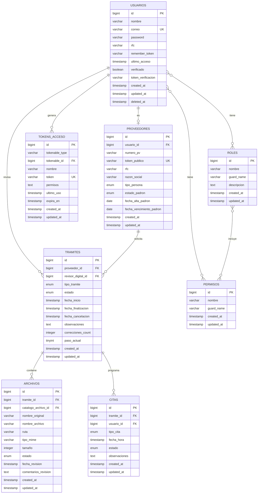

# Diagrama de Clases JWT - Sistema de Gestión de Proveedores

```mermaid
classDiagram
    %% ===== CLASES DE AUTENTICACIÓN =====
    class Usuario {
        +Long id
        +String nombre
        +String correo
        +String password
        +String rfc
        +DateTime ultimo_acceso
        +Boolean verificado
        +String token_verificacion
        +String remember_token
        +DateTime created_at
        +DateTime updated_at
        +DateTime deleted_at
        +crearToken(nombre: String, permisos: Array): TokenAcceso
        +obtenerTokens(): HasMany
        +tieneRol(rol: String): Boolean
        +tienePermiso(permiso: String): Boolean
        +estaVerificado(): Boolean
        +obtenerEmailParaReset(): String
        +obtenerProveedor(): HasOne
        +obtenerTramitesAsignados(): HasMany
        +obtenerNotificaciones(): HasMany
    }

    class TokenAcceso {
        +Long id
        +String tokenable_type
        +Long tokenable_id
        +String nombre
        +String token
        +Text permisos
        +DateTime ultimo_uso
        +DateTime expira_en
        +DateTime created_at
        +DateTime updated_at
        +puede(permiso: String): Boolean
        +puedeCualquiera(permisos: Array): Boolean
        +actualizarUltimoUso(): void
        +estaExpirado(): Boolean
    }

    %% ===== CLASES DEL DOMINIO =====
    class Proveedor {
        +Long id
        +Long usuario_id
        +String numero_pv
        +String token_publico
        +String rfc
        +String razon_social
        +String tipo_persona
        +String estado_padron
        +Date fecha_alta_padron
        +Date fecha_vencimiento_padron
        +DateTime created_at
        +DateTime updated_at
        +obtenerUsuario(): BelongsTo
        +obtenerTramites(): HasMany
        +obtenerDatosGenerales(): HasMany
        +obtenerApoderadosLegales(): HasMany
        +obtenerDatosConstitutivos(): HasMany
        +obtenerAccionistas(): HasMany
        +obtenerContactos(): HasMany
        +obtenerActividades(): HasMany
        +obtenerDirecciones(): HasMany
        +obtenerArchivos(): HasMany
        +generarTokenPublico(): String
        +obtenerTokenPublico(): String
        +buscarPorToken(token: String): Proveedor
        +sincronizarDatosGenerales(datos: Object): void
        +estaActivo(): Boolean
        +puedeReutilizarse(): Boolean
    }

    class Tramite {
        +Long id
        +Long proveedor_id
        +Long revisor_digital_id
        +String tipo_tramite
        +String estado
        +DateTime fecha_inicio
        +DateTime fecha_finalizacion
        +DateTime fecha_cancelacion
        +Text observaciones
        +Integer correcciones_count
        +Integer paso_actual
        +DateTime created_at
        +DateTime updated_at
        +obtenerProveedor(): BelongsTo
        +obtenerRevisorDigital(): BelongsTo
        +obtenerDatosGenerales(): HasMany
        +obtenerApoderadosLegales(): HasMany
        +obtenerDatosConstitutivos(): HasMany
        +obtenerAccionistas(): HasMany
        +obtenerContactos(): HasMany
        +obtenerActividades(): HasMany
        +obtenerDirecciones(): HasMany
        +obtenerArchivos(): HasMany
        +obtenerSeccionesRevision(): HasMany
        +obtenerCitas(): HasMany
        +obtenerRevisionesTramite(): HasMany
        +estaCompletado(): Boolean
        +puedeSerAprobado(): Boolean
        +obtenerProgreso(): Integer
        +siguientePaso(): void
        +estaEnRevision(): Boolean
        +requiereCorrecciones(): Boolean
    }

    class Archivo {
        +Long id
        +Long tramite_id
        +Long catalogo_archivo_id
        +String nombre_original
        +String nombre_archivo
        +String ruta
        +String tipo_mime
        +Integer tamaño
        +String estado
        +DateTime fecha_revision
        +Text comentarios_revision
        +DateTime created_at
        +DateTime updated_at
        +obtenerTramite(): BelongsTo
        +obtenerCatalogoArchivo(): BelongsTo
        +estaAprobado(): Boolean
        +estaRechazado(): Boolean
        +obtenerUrlDescarga(): String
        +puedeSerRevisado(): Boolean
    }

    class Cita {
        +Long id
        +Long tramite_id
        +Long usuario_id
        +String tipo_cita
        +DateTime fecha_hora
        +String estado
        +Text observaciones
        +DateTime created_at
        +DateTime updated_at
        +obtenerTramite(): BelongsTo
        +obtenerUsuario(): BelongsTo
        +estaProgramada(): Boolean
        +fueAtendida(): Boolean
        +puedeReprogramarse(): Boolean
        +estaCancelada(): Boolean
        +obtenerFechaFormateada(): String
    }

    %% ===== CLASES DE ROLES Y PERMISOS =====
    class Rol {
        +Long id
        +String nombre
        +String guard_name
        +String descripcion
        +DateTime created_at
        +DateTime updated_at
        +obtenerPermisos(): BelongsToMany
        +obtenerUsuarios(): MorphToMany
        +asignarPermiso(permiso: Permiso): void
        +removerPermiso(permiso: Permiso): void
        +tienePermiso(permiso: String): Boolean
        +obtenerNombre(): String
    }

    class Permiso {
        +Long id
        +String nombre
        +String guard_name
        +DateTime created_at
        +DateTime updated_at
        +obtenerRoles(): BelongsToMany
        +obtenerUsuarios(): MorphToMany
        +asignarARol(rol: Rol): void
        +asignarAUsuario(usuario: Usuario): void
        +obtenerNombre(): String
    }

    %% ===== CLASES DE SERVICIOS =====
    class ServicioRfcProveedor {
        +determinarTipoPersona(rfc: String): String
        +obtenerRfcUsuario(): String
        +buscarProveedoresPorRfc(rfc: String): Collection
        +buscarProveedorActivo(rfc: String): Proveedor
        +buscarProveedorReutilizable(rfc: String): Proveedor
        +proveedorEstaActivo(proveedor: Proveedor): Boolean
        +proveedorPuedeReutilizarse(proveedor: Proveedor): Boolean
        +gestionarProveedorPorTramite(rfc: String, tipoTramite: String, datos: Array): Array
        +determinarAccionPorTipoTramite(rfc: String, tipoTramite: String, tramiteId: Long): String
        +generarNumeroProveedor(): String
        +depurarProveedoresRfc(rfc: String): Array
        +validarFormatoRfc(rfc: String): Boolean
        +obtenerProveedoresVencidos(): Collection
    }

    class ServicioTramite {
        -ServicioDatosGenerales datosGeneralesService
        -ServicioDomicilio domicilioService
        -ServicioActividades actividadesService
        -ServicioAccionistas accionistasService
        -ServicioApoderado apoderadoService
        -ServicioArchivos archivosService
        -ServicioConstancia constanciaService
        -ServicioContacto contactoService
        -ServicioConstitucion constitucionService
        +crearTramiteCompleto(request: Request): Tramite
        +crearObtenerProveedor(request: Request): Proveedor
        +crearTramiteBase(proveedor: Proveedor, request: Request): Tramite
        +obtenerRevisorDigitalDisponible(): Usuario
        +guardarSeccionesUltraOptimizado(tramite: Tramite, proveedor: Proveedor, request: Request): void
        +crearRevisionDigitalAutomatica(tramite: Tramite): void
        +validarDatosTramite(datos: Object): Boolean
        +obtenerTramitesPendientes(): Collection
        +asignarRevisor(tramite: Tramite, revisor: Usuario): void
    }

    class ServicioDecisionesFinales {
        +aprobarYAsignarProveedor(tramiteId: Long, comentarioGeneral: String): Array
        +aprobarYActivarProveedor(tramiteId: Long, comentarioGeneral: String): Array
        +rechazarTramite(tramiteId: Long, comentarioGeneral: String): Array
        +solicitarCorrecciones(tramiteId: Long, comentarioGeneral: String): Array
        +procesarDecisionFinal(tramite: Tramite, decision: String, comentario: String): Array
        +validarDecision(decision: String): Boolean
        +notificarDecision(tramite: Tramite, decision: String): void
        +generarOficio(tramite: Tramite): String
    }

    %% ===== CLASES DE MIDDLEWARE =====
    class MiddlewareProveedor {
        +handle(request: Request, next: Closure): Response
        +verificarProveedorActivo(usuario: Usuario): Boolean
        +verificarTramitePendiente(proveedor: Proveedor): Boolean
        +verificarPermisosProveedor(usuario: Usuario, proveedor: Proveedor): Boolean
        +validarAccesoProveedor(usuario: Usuario): Boolean
    }

    class MiddlewareTramite {
        +handle(request: Request, next: Closure): Response
        +verificarTramitePropio(usuario: Usuario, tramiteId: Long): Boolean
        +verificarRevisorAsignado(usuario: Usuario, tramiteId: Long): Boolean
        +verificarEstadoTramite(tramite: Tramite, estadoRequerido: String): Boolean
        +validarAccesoTramite(usuario: Usuario, tramite: Tramite): Boolean
    }

    class MiddlewareRevisor {
        +handle(request: Request, next: Closure): Response
        +verificarRolRevisor(usuario: Usuario): Boolean
        +verificarTramitesAsignados(usuario: Usuario): Boolean
        +verificarPermisosRevision(usuario: Usuario, tramite: Tramite): Boolean
        +validarAccesoRevision(usuario: Usuario): Boolean
    }

    %% ===== CLASES DE CONTROLADORES =====
    class ControladorProveedor {
        -ServicioRfcProveedor rfcProveedorService
        -ServicioTramite tramiteService
        +mostrarLista(request: Request): View
        +mostrarDetalle(proveedor: Proveedor): View
        +mostrarFormularioCrear(): View
        +guardarProveedor(request: Request): Response
        +mostrarFormularioEditar(proveedor: Proveedor): View
        +actualizarProveedor(request: Request, proveedor: Proveedor): Response
        +eliminarProveedor(proveedor: Proveedor): Response
        +buscarPorRfc(rfc: String): JsonResponse
        +generarTokenPublico(proveedor: Proveedor): JsonResponse
        +validarDatosProveedor(request: Request): Boolean
    }

    class ControladorTramite {
        -ServicioTramite tramiteService
        -ServicioDecisionesFinales decisionesService
        +mostrarLista(request: Request): View
        +mostrarFormularioCrear(): View
        +guardarTramite(request: Request): Response
        +mostrarDetalle(tramite: Tramite): View
        +mostrarFormularioEditar(tramite: Tramite): View
        +actualizarTramite(request: Request, tramite: Tramite): Response
        +eliminarTramite(tramite: Tramite): Response
        +aprobarTramite(tramite: Tramite, request: Request): JsonResponse
        +rechazarTramite(tramite: Tramite, request: Request): JsonResponse
        +solicitarCorrecciones(tramite: Tramite, request: Request): JsonResponse
        +validarDatosTramite(request: Request): Boolean
        +obtenerProgresoTramite(tramite: Tramite): JsonResponse
    }

    class ControladorRevision {
        -ServicioRevisionDigital revisionDigitalService
        -ServicioRevisionDomiciliaria revisionDomiciliariaService
        +mostrarLista(request: Request): View
        +mostrarRevisionDigital(tramite: Tramite): View
        +mostrarRevisionDomiciliaria(tramite: Tramite): View
        +aprobarSeccion(seccionId: Long, request: Request): JsonResponse
        +rechazarSeccion(seccionId: Long, request: Request): JsonResponse
        +finalizarRevision(tramiteId: Long, request: Request): JsonResponse
        +validarRevision(seccionId: Long): Boolean
        +obtenerProgresoRevision(tramiteId: Long): JsonResponse
    }

    %% ===== RELACIONES =====
    Usuario ||--o{ TokenAcceso : "genera"
    Usuario ||--o| Proveedor : "es"
    Usuario ||--o{ Tramite : "revisa"
    Proveedor ||--o{ Tramite : "solicita"
    Tramite ||--o{ Archivo : "contiene"
    Tramite ||--o{ Cita : "programa"
    Usuario }o--o{ Rol : "tiene"
    Usuario }o--o{ Permiso : "tiene"
    Rol }o--o{ Permiso : "incluye"
    ControladorProveedor --> ServicioRfcProveedor : "usa"
    ControladorProveedor --> ServicioTramite : "usa"
    ControladorTramite --> ServicioTramite : "usa"
    ControladorTramite --> ServicioDecisionesFinales : "usa"
    ControladorRevision --> ServicioRevisionDigital : "usa"
    ControladorRevision --> ServicioRevisionDomiciliaria : "usa"
    ServicioRfcProveedor --> Proveedor : "gestiona"
    ServicioTramite --> Tramite : "crea"
    ServicioTramite --> Proveedor : "gestiona"
    ServicioDecisionesFinales --> Tramite : "decide"
    MiddlewareProveedor --> Proveedor : "verifica"
    MiddlewareTramite --> Tramite : "verifica"
    MiddlewareRevisor --> Usuario : "verifica"
```

## Diagrama de Flujo de Autenticación



## Diagrama de Estados del Sistema



## Estructura de Base de Datos



## Características del Sistema JWT

### 🔐 **Autenticación Específica para Proveedores**
- **Autenticación por RFC**: Los proveedores se autentican usando su RFC
- **Tokens de Acceso Personal**: Generación automática con permisos específicos
- **Verificación de Email**: Confirmación obligatoria antes del acceso
- **Tokens Públicos**: Para acceso a información pública de proveedores

### 🛡️ **Autorización por Roles de Negocio**
- **Proveedor**: Acceso a sus propios trámites y documentos
- **Revisor Digital**: Revisión de documentos y trámites asignados
- **Revisor Presencial**: Gestión de citas y revisiones presenciales
- **Revisor Domiciliario**: Revisiones en domicilio del proveedor
- **Administrador**: Control total del sistema

### 📊 **Gestión de Estados de Trámites**
- **Pendiente**: Trámite recién creado
- **Revisión Digital**: En proceso de revisión de documentos
- **Revisión Presencial**: Requiere cita presencial
- **Revisión Domiciliaria**: Requiere visita al domicilio
- **Para Corrección**: Se requieren ajustes
- **Aprobado**: Trámite finalizado exitosamente
- **Cancelado**: Trámite cancelado

### 🔄 **Flujo de Autenticación Específico**
1. **Login por RFC**: Proveedor ingresa con RFC y contraseña
2. **Validación de Estado**: Verificación de proveedor activo
3. **Generación de Token**: Token con permisos específicos de proveedor
4. **Acceso a Trámites**: Solo puede ver sus propios trámites
5. **Gestión de Documentos**: Subida y gestión de archivos
6. **Seguimiento**: Estado y progreso de trámites

### 🏗️ **Arquitectura Específica del Dominio**
- **ServicioRfcProveedor**: Gestión centralizada de RFC y proveedores
- **ServicioTramite**: Creación y gestión de trámites completos
- **ServicioDecisionesFinales**: Aprobación y rechazo de trámites
- **Middleware Específicos**: Validación de permisos por dominio
- **Tokens Públicos**: Acceso seguro a información pública

### 📋 **Permisos Específicos del Sistema**
- **proveedor.ver**: Ver información de proveedor
- **proveedor.editar**: Editar datos del proveedor
- **tramite.crear**: Crear nuevos trámites
- **tramite.ver**: Ver trámites propios
- **tramite.editar**: Editar trámites en proceso
- **archivo.subir**: Subir documentos
- **archivo.ver**: Ver documentos propios
- **revision.digital**: Realizar revisiones digitales
- **revision.presencial**: Gestionar revisiones presenciales
- **revision.domiciliaria**: Gestionar revisiones domiciliarias
- **cita.crear**: Crear citas
- **cita.ver**: Ver citas asignadas

### 🎯 **Métodos Principales en Español**

#### **Clase Usuario**
- `crearToken()` - Generar token de acceso
- `tieneRol()` - Verificar si tiene un rol específico
- `tienePermiso()` - Verificar si tiene un permiso
- `estaVerificado()` - Verificar si el email está confirmado
- `obtenerProveedor()` - Obtener el proveedor asociado

#### **Clase Proveedor**
- `generarTokenPublico()` - Crear token para acceso público
- `estaActivo()` - Verificar si el proveedor está activo
- `puedeReutilizarse()` - Verificar si puede ser reutilizado
- `sincronizarDatosGenerales()` - Actualizar datos generales

#### **Clase Tramite**
- `estaCompletado()` - Verificar si el trámite está completo
- `puedeSerAprobado()` - Verificar si puede ser aprobado
- `obtenerProgreso()` - Calcular el progreso del trámite
- `siguientePaso()` - Avanzar al siguiente paso
- `estaEnRevision()` - Verificar si está en revisión

#### **Clase ServicioRfcProveedor**
- `determinarTipoPersona()` - Determinar si es persona física o moral
- `buscarProveedorActivo()` - Buscar proveedor activo por RFC
- `gestionarProveedorPorTramite()` - Gestionar proveedor según tipo de trámite
- `validarFormatoRfc()` - Validar formato del RFC

#### **Clase ServicioTramite**
- `crearTramiteCompleto()` - Crear trámite con todas sus secciones
- `obtenerRevisorDigitalDisponible()` - Asignar revisor disponible
- `validarDatosTramite()` - Validar datos del trámite
- `asignarRevisor()` - Asignar revisor al trámite

#### **Clase ServicioDecisionesFinales**
- `aprobarYAsignarProveedor()` - Aprobar y asignar número de proveedor
- `aprobarYActivarProveedor()` - Aprobar y activar proveedor
- `rechazarTramite()` - Rechazar trámite
- `solicitarCorrecciones()` - Solicitar correcciones
- `generarOficio()` - Generar oficio de aprobación
