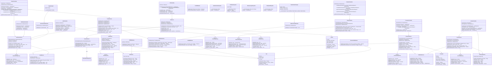

# Diagrama de Clases del Sistema - Arquitectura de Software

```mermaid
classDiagram
    %% ===== CAPA DE PRESENTACIÓN (CONTROLLERS) =====
    class AuthController {
        -authService: AuthService
        +login(request: LoginRequest): JsonResponse
        +register(request: RegisterRequest): JsonResponse
        +logout(request: Request): JsonResponse
        +refresh(request: Request): JsonResponse
        +me(request: Request): JsonResponse
        +verify(token: String): JsonResponse
    }

    class ProveedorController {
        -proveedorService: ProveedorService
        +index(request: Request): JsonResponse
        +store(request: CreateProveedorRequest): JsonResponse
        +show(id: Long): JsonResponse
        +update(id: Long, request: UpdateProveedorRequest): JsonResponse
        +destroy(id: Long): JsonResponse
        +generatePublicToken(id: Long): JsonResponse
    }

    class TramiteController {
        -tramiteService: TramiteService
        -notificationService: NotificationService
        +index(request: Request): JsonResponse
        +store(request: CreateTramiteRequest): JsonResponse
        +show(id: Long): JsonResponse
        +update(id: Long, request: UpdateTramiteRequest): JsonResponse
        +changeStatus(id: Long, request: ChangeStatusRequest): JsonResponse
        +assignRevisor(id: Long, request: AssignRevisorRequest): JsonResponse
        +getByProveedor(proveedorId: Long): JsonResponse
    }

    class ArchivoController {
        -archivoService: ArchivoService
        -fileStorageService: FileStorageService
        +upload(request: UploadFileRequest): JsonResponse
        +download(id: Long): StreamedResponse
        +approve(id: Long, request: ApproveFileRequest): JsonResponse
        +reject(id: Long, request: RejectFileRequest): JsonResponse
        +getByTramite(tramiteId: Long): JsonResponse
    }

    class RevisionController {
        -revisionService: RevisionService
        +startRevision(tramiteId: Long, request: StartRevisionRequest): JsonResponse
        +completeRevision(revisionId: Long, request: CompleteRevisionRequest): JsonResponse
        +approveSection(sectionId: Long, request: ApproveSectionRequest): JsonResponse
        +rejectSection(sectionId: Long, request: RejectSectionRequest): JsonResponse
        +getRevisionHistory(tramiteId: Long): JsonResponse
    }

    class CitaController {
        -citaService: CitaService
        +schedule(request: ScheduleCitaRequest): JsonResponse
        +reschedule(id: Long, request: RescheduleCitaRequest): JsonResponse
        +cancel(id: Long): JsonResponse
        +markAttended(id: Long): JsonResponse
        +markNoShow(id: Long): JsonResponse
        +getAvailableSlots(date: Date): JsonResponse
    }

    class NotificationController {
        -notificationService: NotificationService
        +index(request: Request): JsonResponse
        +markAsRead(id: Long): JsonResponse
        +markAllAsRead(): JsonResponse
        +getUnreadCount(): JsonResponse
    }

    %% ===== CAPA DE SERVICIOS (BUSINESS LOGIC) =====
    class AuthService {
        -userRepository: UserRepository
        -jwtService: JWTService
        -emailService: EmailService
        +authenticate(credentials: Object): AuthResult
        +register(userData: Object): User
        +generateTokens(user: User): TokenPair
        +refreshToken(refreshToken: String): TokenPair
        +sendVerificationEmail(user: User): void
        +verifyEmail(token: String): Boolean
        +logout(user: User): void
    }

    class ProveedorService {
        -proveedorRepository: ProveedorRepository
        -userRepository: UserRepository
        -validationService: ValidationService
        +create(data: Object): Proveedor
        +update(id: Long, data: Object): Proveedor
        +findById(id: Long): Proveedor
        +findByUser(userId: Long): Proveedor
        +generatePublicToken(proveedor: Proveedor): String
        +validateRFC(rfc: String): Boolean
        +isActive(proveedor: Proveedor): Boolean
    }

    class TramiteService {
        -tramiteRepository: TramiteRepository
        -workflowService: WorkflowService
        -notificationService: NotificationService
        -validationService: ValidationService
        +create(proveedorId: Long, data: Object): Tramite
        +update(id: Long, data: Object): Tramite
        +changeStatus(tramite: Tramite, newStatus: StatusTramite): void
        +assignRevisor(tramite: Tramite, revisor: User): void
        +nextStep(tramite: Tramite): void
        +canBeApproved(tramite: Tramite): Boolean
        +generateOficio(tramite: Tramite): Oficio
    }

    class ArchivoService {
        -archivoRepository: ArchivoRepository
        -fileStorageService: FileStorageService
        -validationService: ValidationService
        +upload(tramiteId: Long, file: UploadedFile, catalogoId: Long): Archivo
        +approve(archivo: Archivo, revisor: User): void
        +reject(archivo: Archivo, revisor: User, comentario: String): void
        +validateFile(file: UploadedFile, catalogo: CatalogoArchivo): Boolean
        +getDownloadUrl(archivo: Archivo): String
    }

    class RevisionService {
        -revisionRepository: RevisionRepository
        -seccionRevisionRepository: SeccionRevisionRepository
        -notificationService: NotificationService
        +startRevision(tramite: Tramite, revisor: User, tipo: TipoRevision): RevisionTramite
        +completeRevision(revision: RevisionTramite): void
        +approveSection(seccion: SeccionRevision, revisor: User): void
        +rejectSection(seccion: SeccionRevision, revisor: User, comentario: String): void
        +getRevisionProgress(tramite: Tramite): Object
    }

    class CitaService {
        -citaRepository: CitaRepository
        -calendarService: CalendarService
        -notificationService: NotificationService
        +schedule(tramite: Tramite, fecha: DateTime, tipo: TipoCita): Cita
        +reschedule(cita: Cita, nuevaFecha: DateTime): void
        +cancel(cita: Cita): void
        +markAttended(cita: Cita): void
        +markNoShow(cita: Cita): void
        +getAvailableSlots(date: Date, tipo: TipoCita): List~DateTime~
    }

    class NotificationService {
        -notificationRepository: NotificationRepository
        -emailService: EmailService
        -pushService: PushService
        +send(user: User, notification: Object): void
        +sendEmail(user: User, template: String, data: Object): void
        +sendPush(user: User, message: String): void
        +markAsRead(notification: Notificacion): void
        +getUnreadCount(user: User): Integer
    }

    %% ===== SERVICIOS DE INFRAESTRUCTURA =====
    class JWTService {
        -config: JWTConfig
        +generateAccessToken(user: User): String
        +generateRefreshToken(user: User): String
        +validateToken(token: String): Boolean
        +extractUserFromToken(token: String): User
        +revokeToken(token: String): void
        +isTokenExpired(token: String): Boolean
    }

    class FileStorageService {
        -storageConfig: StorageConfig
        +store(file: UploadedFile, path: String): String
        +delete(path: String): Boolean
        +exists(path: String): Boolean
        +getUrl(path: String): String
        +getSize(path: String): Long
        +validateFile(file: UploadedFile): Boolean
    }

    class EmailService {
        -mailConfig: MailConfig
        -templateEngine: TemplateEngine
        +send(to: String, subject: String, template: String, data: Object): void
        +sendVerification(user: User): void
        +sendNotification(user: User, notification: Object): void
        +sendOficio(proveedor: Proveedor, oficio: Oficio): void
    }

    class ValidationService {
        +validateRFC(rfc: String): Boolean
        +validateCURP(curp: String): Boolean
        +validateEmail(email: String): Boolean
        +validatePhone(phone: String): Boolean
        +validatePostalCode(cp: String): Boolean
        +validateFile(file: UploadedFile, rules: Object): ValidationResult
    }

    class WorkflowService {
        -tramiteRepository: TramiteRepository
        +getNextStatus(currentStatus: StatusTramite, action: String): StatusTramite
        +canTransition(from: StatusTramite, to: StatusTramite): Boolean
        +getRequiredSections(tipoTramite: TipoTramite): List~SeccionTipo~
        +isStepCompleted(tramite: Tramite, step: Integer): Boolean
        +calculateProgress(tramite: Tramite): Integer
    }

    class CalendarService {
        -diasInhabilesRepository: DiasInhabilesRepository
        +isWorkingDay(date: Date): Boolean
        +getAvailableSlots(date: Date, duration: Integer): List~DateTime~
        +addWorkingDays(startDate: Date, days: Integer): Date
        +isHoliday(date: Date): Boolean
    }

    %% ===== CAPA DE DATOS (REPOSITORIES) =====
    class UserRepository {
        <<interface>>
        +findById(id: Long): User
        +findByEmail(email: String): User
        +findByRFC(rfc: String): User
        +create(data: Object): User
        +update(id: Long, data: Object): User
        +delete(id: Long): void
    }

    class ProveedorRepository {
        <<interface>>
        +findById(id: Long): Proveedor
        +findByUserId(userId: Long): Proveedor
        +findByRFC(rfc: String): Proveedor
        +findByTokenPublico(token: String): Proveedor
        +create(data: Object): Proveedor
        +update(id: Long, data: Object): Proveedor
    }

    class TramiteRepository {
        <<interface>>
        +findById(id: Long): Tramite
        +findByProveedor(proveedorId: Long): List~Tramite~
        +findByStatus(status: StatusTramite): List~Tramite~
        +findByRevisor(revisorId: Long): List~Tramite~
        +create(data: Object): Tramite
        +update(id: Long, data: Object): Tramite
    }

    class ArchivoRepository {
        <<interface>>
        +findById(id: Long): Archivo
        +findByTramite(tramiteId: Long): List~Archivo~
        +findByStatus(status: StatusArchivo): List~Archivo~
        +create(data: Object): Archivo
        +update(id: Long, data: Object): Archivo
    }

    class RevisionRepository {
        <<interface>>
        +findById(id: Long): RevisionTramite
        +findByTramite(tramiteId: Long): List~RevisionTramite~
        +findByRevisor(revisorId: Long): List~RevisionTramite~
        +create(data: Object): RevisionTramite
        +update(id: Long, data: Object): RevisionTramite
    }

    class CitaRepository {
        <<interface>>
        +findById(id: Long): Cita
        +findByTramite(tramiteId: Long): List~Cita~
        +findByFecha(fecha: Date): List~Cita~
        +findByAsignado(usuarioId: Long): List~Cita~
        +create(data: Object): Cita
        +update(id: Long, data: Object): Cita
    }

    class NotificationRepository {
        <<interface>>
        +findById(id: Long): Notificacion
        +findByUser(userId: Long): List~Notificacion~
        +findUnreadByUser(userId: Long): List~Notificacion~
        +create(data: Object): Notificacion
        +markAsRead(id: Long): void
    }

    %% ===== MODELOS DE DOMINIO =====
    class User {
        -id: Long
        -nombre: String
        -correo: String
        -rfc: String
        +hasRole(role: String): Boolean
        +hasPermission(permission: String): Boolean
        +isVerified(): Boolean
        +getProveedor(): Proveedor
    }

    class Proveedor {
        -id: Long
        -rfc: String
        -razon_social: String
        -tipo_persona: TipoPersona
        -estado_padron: EstadoPadron
        +isActive(): Boolean
        +getTramites(): List~Tramite~
        +canCreateTramite(): Boolean
    }

    class Tramite {
        -id: Long
        -tipo_tramite: TipoTramite
        -status: StatusTramite
        -paso_actual: Integer
        +isCompleted(): Boolean
        +canBeApproved(): Boolean
        +getProgress(): Integer
        +nextStep(): void
    }

    %% ===== MIDDLEWARE Y FILTROS =====
    class JWTMiddleware {
        -jwtService: JWTService
        +handle(request: Request, next: Closure): Response
        +authenticate(request: Request): User
    }

    class RoleMiddleware {
        +handle(request: Request, next: Closure, roles: String[]): Response
        +hasRequiredRole(user: User, roles: String[]): Boolean
    }

    class PermissionMiddleware {
        +handle(request: Request, next: Closure, permissions: String[]): Response
        +hasRequiredPermission(user: User, permissions: String[]): Boolean
    }

    class CorsMiddleware {
        +handle(request: Request, next: Closure): Response
        +addCorsHeaders(response: Response): Response
    }

    %% ===== EXCEPCIONES =====
    class AuthenticationException {
        +__construct(message: String)
        +render(): JsonResponse
    }

    class ValidationException {
        -errors: Object
        +__construct(errors: Object)
        +getErrors(): Object
        +render(): JsonResponse
    }

    class BusinessLogicException {
        +__construct(message: String, code: Integer)
        +render(): JsonResponse
    }

    class FileUploadException {
        +__construct(message: String)
        +render(): JsonResponse
    }

    %% ===== EVENTOS Y LISTENERS =====
    class TramiteCreated {
        +tramite: Tramite
        +__construct(tramite: Tramite)
    }

    class TramiteStatusChanged {
        +tramite: Tramite
        +oldStatus: StatusTramite
        +newStatus: StatusTramite
        +__construct(tramite: Tramite, oldStatus: StatusTramite, newStatus: StatusTramite)
    }

    class SendTramiteNotification {
        -notificationService: NotificationService
        +handle(event: TramiteCreated): void
    }

    class UpdateTramiteWorkflow {
        -workflowService: WorkflowService
        +handle(event: TramiteStatusChanged): void
    }

    %% ===== RELACIONES =====
    
    %% Controllers -> Services
    AuthController --> AuthService
    ProveedorController --> ProveedorService
    TramiteController --> TramiteService
    TramiteController --> NotificationService
    ArchivoController --> ArchivoService
    ArchivoController --> FileStorageService
    RevisionController --> RevisionService
    CitaController --> CitaService
    NotificationController --> NotificationService

    %% Services -> Repositories
    AuthService --> UserRepository
    AuthService --> JWTService
    AuthService --> EmailService
    ProveedorService --> ProveedorRepository
    ProveedorService --> UserRepository
    ProveedorService --> ValidationService
    TramiteService --> TramiteRepository
    TramiteService --> WorkflowService
    TramiteService --> NotificationService
    ArchivoService --> ArchivoRepository
    ArchivoService --> FileStorageService
    ArchivoService --> ValidationService
    RevisionService --> RevisionRepository
    CitaService --> CitaRepository
    CitaService --> CalendarService
    NotificationService --> NotificationRepository
    NotificationService --> EmailService

    %% Services -> Models
    AuthService --> User
    ProveedorService --> Proveedor
    TramiteService --> Tramite

    %% Infrastructure Services
    CalendarService --> DiasInhabilesRepository : uses

    %% Events and Listeners
    TramiteCreated --> SendTramiteNotification
    TramiteStatusChanged --> UpdateTramiteWorkflow
    SendTramiteNotification --> NotificationService
    UpdateTramiteWorkflow --> WorkflowService

    %% Middleware Dependencies
    JWTMiddleware --> JWTService
    RoleMiddleware --> User
    PermissionMiddleware --> User
```