# Diagrama Entidad-Relación - Sistema JWT

Este documento contiene el diagrama entidad-relación completo del sistema JWT basado en las migraciones de Laravel.

## Diagrama ER Completo

```mermaid
erDiagram
    %% Entidades de Usuarios y Autenticación
    USERS {
        id bigint PK
        nombre string
        correo string UK
        password string
        remember_token string
        rfc string
        ultimo_acceso timestamp
        verification boolean
        verification_token string
        created_at timestamp
        updated_at timestamp
        deleted_at timestamp
    }
    
    %% Sistema de Permisos y Roles
    PERMISSIONS {
        id bigint PK
        name string
        guard_name string
        created_at timestamp
        updated_at timestamp
    }
    
    ROLES {
        id bigint PK
        name string
        guard_name string
        description text
        created_at timestamp
        updated_at timestamp
    }
    
    MODEL_HAS_PERMISSIONS {
        permission_id bigint FK
        model_type string
        model_morph_key bigint
    }
    
    MODEL_HAS_ROLES {
        role_id bigint FK
        model_type string
        model_morph_key bigint
    }
    
    ROLE_HAS_PERMISSIONS {
        permission_id bigint FK
        role_id bigint FK
    }
    
    %% Entidades Geográficas
    PAISES {
        id bigint PK
        nombre string
        created_at timestamp
        updated_at timestamp
    }
    
    ESTADOS {
        id bigint PK
        nombre string
        pais_id bigint FK
        created_at timestamp
        updated_at timestamp
    }
    
    MUNICIPIOS {
        id bigint PK
        nombre string
        estado_id bigint FK
        created_at timestamp
        updated_at timestamp
    }
    
    LOCALIDADES {
        id bigint PK
        nombre string
        municipio_id bigint FK
        created_at timestamp
        updated_at timestamp
    }
    
    TIPOS_ASENTAMIENTO {
        id bigint PK
        nombre string
        created_at timestamp
        updated_at timestamp
    }
    
    ASENTAMIENTOS {
        id bigint PK
        nombre string
        codigo_postal string
        localidad_id bigint FK
        tipo_asentamiento_id bigint FK
        created_at timestamp
        updated_at timestamp
    }
    
    COORDENADAS {
        id bigint PK
        latitud decimal
        longitud decimal
        created_at timestamp
        updated_at timestamp
    }
    
    %% Entidades de Negocio Principal
    PROVEEDORES {
        id bigint PK
        usuario_id bigint FK
        pv_numero string
        rfc string
        razon_social string
        tipo_persona enum
        estado_padron enum
        fecha_alta_padron date
        fecha_vencimiento_padron date
        token_publico string
        created_at timestamp
        updated_at timestamp
    }
    
    TRAMITES {
        id bigint PK
        proveedor_id bigint FK
        revisor_digital_id bigint FK
        tipo_tramite enum
        status enum
        fecha_inicio timestamp
        fecha_finalizacion timestamp
        fecha_cancelacion timestamp
        observaciones text
        correcciones_count integer
        paso_actual tinyint
        created_at timestamp
        updated_at timestamp
    }
    
    %% Datos del Trámite
    DATOS_GENERALES {
        id bigint PK
        tramite_id bigint FK
        proveedor_id bigint FK
        curp string
        razon_social string
        pagina_web string
        telefono string
        status enum
        created_at timestamp
        updated_at timestamp
    }
    
    INSTRUMENTOS_NOTARIALES {
        id bigint PK
        numero_escritura string
        numero_escritura_constitutiva string
        fecha_constitucion date
        nombre_notario string
        estado_id bigint FK
        numero_notario integer
        numero_registro_publico string
        fecha_inscripcion date
        created_at timestamp
        updated_at timestamp
    }
    
    APODERADO_LEGAL {
        id bigint PK
        tramite_id bigint FK
        proveedor_id bigint FK
        instrumento_notarial_id bigint FK
        nombre_apoderado string
        rfc string
        numero_escritura_constitutiva_poder string
        numero_registro_publico_poder string
        fecha_inscripcion_poder date
        fecha_poder date
        status enum
        created_at timestamp
        updated_at timestamp
    }
    
    DATOS_CONSTITUTIVOS {
        id bigint PK
        tramite_id bigint FK
        proveedor_id bigint FK
        instrumento_notarial_id bigint FK
        status enum
        created_at timestamp
        updated_at timestamp
    }
    
    ACCIONISTAS {
        id bigint PK
        tramite_id bigint FK
        proveedor_id bigint FK
        nombre string
        rfc string
        porcentaje_participacion decimal
        status enum
        created_at timestamp
        updated_at timestamp
    }
    
    CONTACTOS {
        id bigint PK
        tramite_id bigint FK
        proveedor_id bigint FK
        nombre_contacto string
        cargo string
        correo_electronico string
        telefono string
        status enum
        created_at timestamp
        updated_at timestamp
    }
    
    DIRECCIONES {
        id bigint PK
        tramite_id bigint FK
        proveedor_id bigint FK
        estado_id bigint FK
        coordenada_id bigint FK
        calle string
        entre_calle string
        y_calle string
        numero_exterior string
        numero_interior string
        colonia string
        codigo_postal string
        municipio string
        asentamiento string
        status enum
        created_at timestamp
        updated_at timestamp
    }
    
    %% Actividades y Sectores
    SECTORES {
        id bigint PK
        nombre string
        codigo string
        descripcion text
        created_at timestamp
        updated_at timestamp
    }
    
    ACTIVIDAD {
        id bigint PK
        created_at timestamp
        updated_at timestamp
    }
    
    ACTIVIDADES {
        id bigint PK
        created_at timestamp
        updated_at timestamp
    }
    
    %% Archivos y Documentos
    CATALOGO_ARCHIVOS {
        id bigint PK
        nombre string
        descripcion text
        tipo_persona enum
        tipo_archivo enum
        es_visible boolean
        created_at timestamp
        updated_at timestamp
    }
    
    ARCHIVOS {
        id bigint PK
        tramite_id bigint FK
        proveedor_id bigint FK
        catalogo_archivo_id bigint FK
        revisado_por bigint FK
        nombre_original string
        nombre_archivo string
        ruta string
        extension string
        tamaño bigint
        status enum
        comentario_revision text
        fecha_revision timestamp
        created_at timestamp
        updated_at timestamp
    }
    
    %% Revisiones y Citas
    REVISIONES_TRAMITE {
        id bigint PK
        tramite_id bigint FK
        revisor_id bigint FK
        tipo_revision enum
        estado enum
        observaciones text
        fecha_inicio timestamp
        fecha_fin timestamp
        intento tinyint
        created_at timestamp
        updated_at timestamp
    }
    
    SECCIONES_REVISION {
        id bigint PK
        created_at timestamp
        updated_at timestamp
        fecha_revision timestamp
    }
    
    CITAS {
        id bigint PK
        tramite_id bigint FK
        asignado_a bigint FK
        tipo_cita enum
        fecha_cita timestamp
        estado enum
        intento tinyint
        created_at timestamp
        updated_at timestamp
    }
    
    %% Oficios y Notificaciones
    OFICIOS {
        id bigint PK
        tramite_id bigint FK
        proveedor_id bigint FK
        numero_oficio string
        fecha_oficio date
        url string
        contenido text
        estado string
        created_at timestamp
        updated_at timestamp
    }
    
    NOTIFICACIONES {
        id bigint PK
        usuario_id bigint FK
        tipo enum
        titulo string
        mensaje text
        leida boolean
        datos_adicionales json
        accion_url string
        fecha_lectura timestamp
        created_at timestamp
        updated_at timestamp
    }
    
    %% Tablas del Sistema
    DIAS_INHABILES {
        id bigint PK
        created_at timestamp
        updated_at timestamp
    }
    
    LOGS {
        id bigint PK
        created_at timestamp
        updated_at timestamp
    }
    
    %% Relaciones Geográficas
    PAISES ||--o{ ESTADOS : "pais_id"
    ESTADOS ||--o{ MUNICIPIOS : "estado_id"
    MUNICIPIOS ||--o{ LOCALIDADES : "municipio_id"
    LOCALIDADES ||--o{ ASENTAMIENTOS : "localidad_id"
    TIPOS_ASENTAMIENTO ||--o{ ASENTAMIENTOS : "tipo_asentamiento_id"
    
    %% Relaciones de Usuario y Autenticación
    USERS ||--o{ PROVEEDORES : "usuario_id"
    USERS ||--o{ NOTIFICACIONES : "usuario_id"
    
    %% Relaciones de Permisos
    PERMISSIONS ||--o{ MODEL_HAS_PERMISSIONS : "permission_id"
    ROLES ||--o{ MODEL_HAS_ROLES : "role_id"
    PERMISSIONS ||--o{ ROLE_HAS_PERMISSIONS : "permission_id"
    ROLES ||--o{ ROLE_HAS_PERMISSIONS : "role_id"
    
    %% Relaciones de Trámites
    PROVEEDORES ||--o{ TRAMITES : "proveedor_id"
    USERS ||--o{ TRAMITES : "revisor_digital_id"
    TRAMITES ||--o{ DATOS_GENERALES : "tramite_id"
    TRAMITES ||--o{ APODERADO_LEGAL : "tramite_id"
    TRAMITES ||--o{ DATOS_CONSTITUTIVOS : "tramite_id"
    TRAMITES ||--o{ ACCIONISTAS : "tramite_id"
    TRAMITES ||--o{ CONTACTOS : "tramite_id"
    TRAMITES ||--o{ DIRECCIONES : "tramite_id"
    TRAMITES ||--o{ ARCHIVOS : "tramite_id"
    TRAMITES ||--o{ REVISIONES_TRAMITE : "tramite_id"
    TRAMITES ||--o{ CITAS : "tramite_id"
    TRAMITES ||--o{ OFICIOS : "tramite_id"
    
    %% Relaciones de Proveedores
    PROVEEDORES ||--o{ DATOS_GENERALES : "proveedor_id"
    PROVEEDORES ||--o{ APODERADO_LEGAL : "proveedor_id"
    PROVEEDORES ||--o{ DATOS_CONSTITUTIVOS : "proveedor_id"
    PROVEEDORES ||--o{ ACCIONISTAS : "proveedor_id"
    PROVEEDORES ||--o{ CONTACTOS : "proveedor_id"
    PROVEEDORES ||--o{ DIRECCIONES : "proveedor_id"
    PROVEEDORES ||--o{ ARCHIVOS : "proveedor_id"
    PROVEEDORES ||--o{ OFICIOS : "proveedor_id"
    
    %% Relaciones de Instrumentos Notariales
    ESTADOS ||--o{ INSTRUMENTOS_NOTARIALES : "estado_id"
    INSTRUMENTOS_NOTARIALES ||--o{ APODERADO_LEGAL : "instrumento_notarial_id"
    INSTRUMENTOS_NOTARIALES ||--o{ DATOS_CONSTITUTIVOS : "instrumento_notarial_id"
    
    %% Relaciones de Archivos
    CATALOGO_ARCHIVOS ||--o{ ARCHIVOS : "catalogo_archivo_id"
    USERS ||--o{ ARCHIVOS : "revisado_por"
    
    %% Relaciones de Revisiones
    USERS ||--o{ REVISIONES_TRAMITE : "revisor_id"
    USERS ||--o{ CITAS : "asignado_a"
    
    %% Relaciones de Direcciones
    ESTADOS ||--o{ DIRECCIONES : "estado_id"
    COORDENADAS ||--o{ DIRECCIONES : "coordenada_id"
```



## Relaciones Principales del Sistema

### 1. Gestión de Usuarios y Autenticación
- **USERS**: Tabla principal de usuarios del sistema
- **PERMISSIONS/ROLES**: Sistema de permisos basado en Spatie Laravel Permission
- **PROVEEDORES**: Entidades que pueden realizar trámites, vinculadas a usuarios

### 2. Estructura Geográfica
- **PAISES → ESTADOS → MUNICIPIOS → LOCALIDADES → ASENTAMIENTOS**
- **TIPOS_ASENTAMIENTO**: Catálogo de tipos de asentamiento
- **COORDENADAS**: Ubicaciones geográficas precisas

### 3. Gestión de Trámites
- **TRAMITES**: Entidad central del sistema
- **DATOS_GENERALES**: Información básica del trámite
- **INSTRUMENTOS_NOTARIALES**: Documentos notariales
- **APODERADO_LEGAL**: Representantes legales
- **DATOS_CONSTITUTIVOS**: Información constitutiva de empresas
- **ACCIONISTAS**: Socios y accionistas
- **CONTACTOS**: Personas de contacto
- **DIRECCIONES**: Ubicaciones físicas

### 4. Gestión de Archivos
- **CATALOGO_ARCHIVOS**: Tipos de documentos requeridos
- **ARCHIVOS**: Documentos subidos por los proveedores

### 5. Proceso de Revisión
- **REVISIONES_TRAMITE**: Seguimiento de revisiones
- **SECCIONES_REVISION**: Secciones específicas de revisión
- **CITAS**: Programación de citas presenciales/domiciliarias

### 6. Comunicación y Seguimiento
- **OFICIOS**: Documentos oficiales generados
- **NOTIFICACIONES**: Sistema de notificaciones a usuarios

## Enumeraciones Importantes

### PROVEEDORES
- **tipo_persona**: 'Física', 'Moral'
- **estado_padron**: 'Activo', 'Inactivo', 'Vencido', 'Pendiente', 'Cancelado'

### TRAMITES
- **tipo_tramite**: 'Inscripcion', 'Renovacion', 'Actualizacion'
- **status**: 'Pendiente', 'Revision_Digital', 'Revision_Presencial', 'Revision_Domiciliaria', 'Aprobado', 'Rechazado', 'Para_Correccion', 'Cancelado'

### ARCHIVOS
- **status**: 'Pendiente', 'Aprobado', 'Rechazado'

### CITAS
- **tipo_cita**: 'Presencial', 'Domiciliaria', 'Digital'
- **estado**: 'Asignada', 'Cancelada', 'Asistida', 'No_Asistio'

### REVISIONES_TRAMITE
- **tipo_revision**: 'Digital', 'Presencial', 'Domiciliaria'
- **estado**: 'Pendiente', 'En_Proceso', 'Finalizada'

### NOTIFICACIONES
- **tipo**: 'informativo', 'advertencia', 'error', 'exito', 'Tramite', 'Cita'

## Flujo Principal del Sistema

### 1. Registro de Proveedor
```
Usuario → Registro → Verificación → Proveedor → Solicitud Trámite
```

### 2. Proceso de Trámite
```
Trámite → Datos Generales → Documentos → Revisión Digital → Cita → Aprobación/Rechazo
```

### 3. Gestión de Archivos
```
Subida → Validación → Revisión → Aprobación/Rechazo → Notificación
```

### 4. Sistema de Notificaciones
```
Evento → Generación Notificación → Envío → Lectura → Seguimiento
```

## Consideraciones Técnicas

### Índices Recomendados
- `users.correo` (UNIQUE)
- `proveedores.rfc` (INDEX)
- `tramites.proveedor_id` (INDEX)
- `tramites.status` (INDEX)
- `archivos.tramite_id` (INDEX)
- `notificaciones.usuario_id, leida` (COMPOSITE)

### Optimizaciones
- **Soft Deletes**: Implementado en usuarios
- **Timestamps**: Automáticos en todas las tablas
- **Foreign Keys**: Con cascadas apropiadas
- **Enums**: Para valores predefinidos
- **JSON**: Para datos adicionales flexibles

### Seguridad
- **Verificación de usuarios**: Campo verification
- **Tokens públicos**: Para proveedores
- **Soft deletes**: Preservación de datos
- **Permisos granulares**: Sistema de roles y permisos