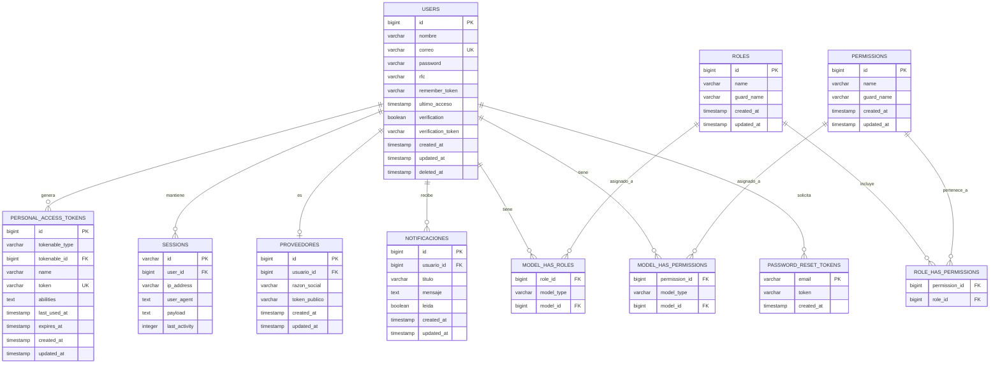
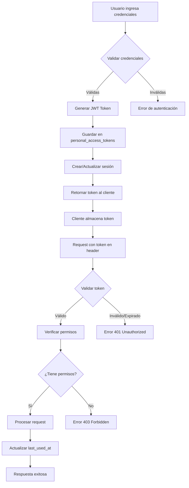
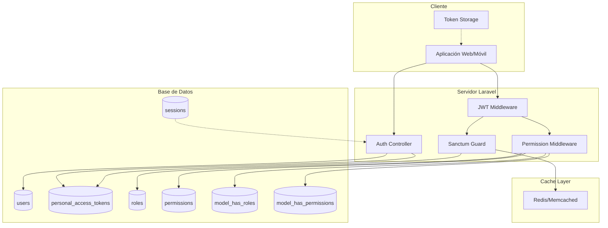
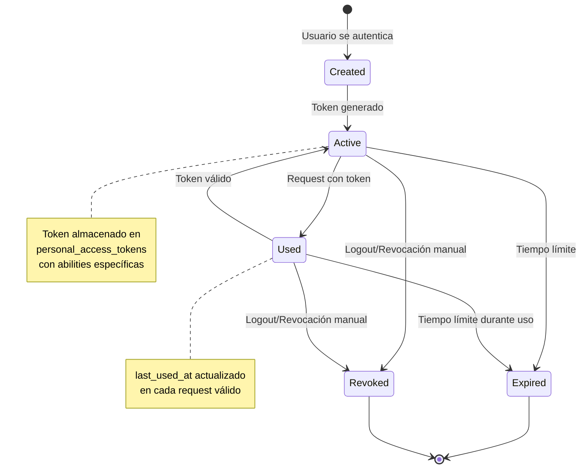

# Diagrama Visual JWT - Entidad Relación

## Diagrama ER en formato Mermaid

```mermaid
erDiagram
    USERS {
        bigint id PK
        varchar nombre
        varchar correo UK
        varchar password
        varchar rfc
        varchar remember_token
        timestamp ultimo_acceso
        boolean verification
        varchar verification_token
        timestamp created_at
        timestamp updated_at
        timestamp deleted_at
    }

    PERSONAL_ACCESS_TOKENS {
        bigint id PK
        varchar tokenable_type
        bigint tokenable_id FK
        varchar name
        varchar token UK
        text abilities
        timestamp last_used_at
        timestamp expires_at
        timestamp created_at
        timestamp updated_at
    }

    SESSIONS {
        varchar id PK
        bigint user_id FK
        varchar ip_address
        text user_agent
        text payload
        integer last_activity
    }

    ROLES {
        bigint id PK
        varchar name
        varchar guard_name
        timestamp created_at
        timestamp updated_at
    }

    PERMISSIONS {
        bigint id PK
        varchar name
        varchar guard_name
        timestamp created_at
        timestamp updated_at
    }

    MODEL_HAS_ROLES {
        bigint role_id FK
        varchar model_type
        bigint model_id FK
    }

    MODEL_HAS_PERMISSIONS {
        bigint permission_id FK
        varchar model_type
        bigint model_id FK
    }

    ROLE_HAS_PERMISSIONS {
        bigint permission_id FK
        bigint role_id FK
    }

    PASSWORD_RESET_TOKENS {
        varchar email PK
        varchar token
        timestamp created_at
    }

    PROVEEDORES {
        bigint id PK
        bigint usuario_id FK
        varchar razon_social
        varchar token_publico
        timestamp created_at
        timestamp updated_at
    }

    NOTIFICACIONES {
        bigint id PK
        bigint usuario_id FK
        varchar titulo
        text mensaje
        boolean leida
        timestamp created_at
        timestamp updated_at
    }

    %% Relaciones principales
    USERS ||--o{ PERSONAL_ACCESS_TOKENS : "genera"
    USERS ||--o{ SESSIONS : "mantiene"
    USERS ||--o| PROVEEDORES : "es"
    USERS ||--o{ NOTIFICACIONES : "recibe"
    
    %% Relaciones de roles y permisos
    USERS ||--o{ MODEL_HAS_ROLES : "tiene"
    ROLES ||--o{ MODEL_HAS_ROLES : "asignado_a"
    USERS ||--o{ MODEL_HAS_PERMISSIONS : "tiene"
    PERMISSIONS ||--o{ MODEL_HAS_PERMISSIONS : "asignado_a"
    ROLES ||--o{ ROLE_HAS_PERMISSIONS : "incluye"
    PERMISSIONS ||--o{ ROLE_HAS_PERMISSIONS : "pertenece_a"
    
    %% Relación de recuperación de contraseña
    USERS ||--o{ PASSWORD_RESET_TOKENS : "solicita"
```

## Diagrama de Flujo de Autenticación JWT

```mermaid
flowchart TD
    A[Usuario ingresa credenciales] --> B{Validar credenciales}
    B -->|Válidas| C[Generar JWT Token]
    B -->|Inválidas| D[Error de autenticación]
    
    C --> E[Guardar en personal_access_tokens]
    E --> F[Crear/Actualizar sesión]
    F --> G[Retornar token al cliente]
    
    G --> H[Cliente almacena token]
    H --> I[Request con token en header]
    I --> J{Validar token}
    
    J -->|Válido| K[Verificar permisos]
    J -->|Inválido/Expirado| L[Error 401 Unauthorized]
    
    K --> M{¿Tiene permisos?}
    M -->|Sí| N[Procesar request]
    M -->|No| O[Error 403 Forbidden]
    
    N --> P[Actualizar last_used_at]
    P --> Q[Respuesta exitosa]
```

## Diagrama de Arquitectura del Sistema JWT

```mermaid
graph TB
    subgraph "Cliente"
        A[Aplicación Web/Móvil]
        B[Token Storage]
    end
    
    subgraph "Servidor Laravel"
        C[Auth Controller]
        D[JWT Middleware]
        E[Sanctum Guard]
        F[Permission Middleware]
    end
    
    subgraph "Base de Datos"
        G[(users)]
        H[(personal_access_tokens)]
        I[(sessions)]
        J[(roles)]
        K[(permissions)]
        L[(model_has_roles)]
        M[(model_has_permissions)]
    end
    
    subgraph "Cache Layer"
        N[Redis/Memcached]
    end
    
    A --> C
    C --> G
    C --> H
    A --> D
    D --> E
    E --> H
    E --> N
    D --> F
    F --> J
    F --> K
    F --> L
    F --> M
    
    B -.-> A
    I -.-> C
```

## Estados del Token JWT

```mermaid
stateDiagram-v2
    [*] --> Created: Usuario se autentica
    Created --> Active: Token generado
    Active --> Used: Request con token
    Used --> Active: Token válido
    Active --> Expired: Tiempo límite
    Active --> Revoked: Logout/Revocación manual
    Used --> Expired: Tiempo límite durante uso
    Used --> Revoked: Logout/Revocación manual
    Expired --> [*]
    Revoked --> [*]
    
    note right of Active
        Token almacenado en
        personal_access_tokens
        con abilities específicas
    end note
    
    note right of Used
        last_used_at actualizado
        en cada request válido
    end note
```